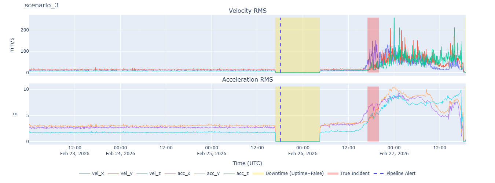
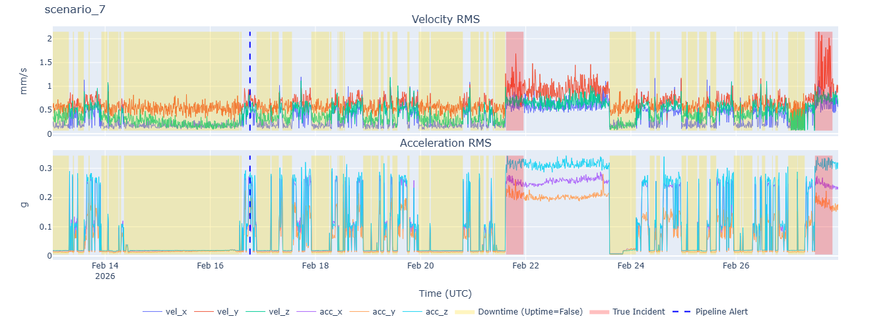
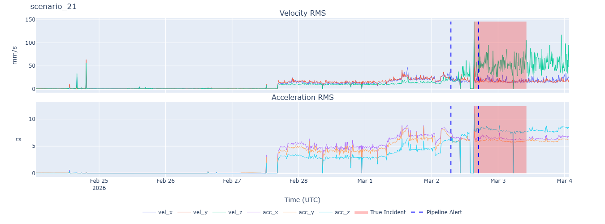
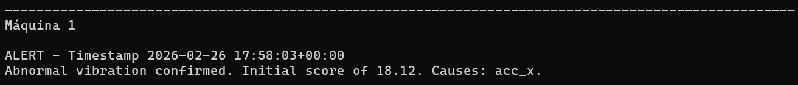
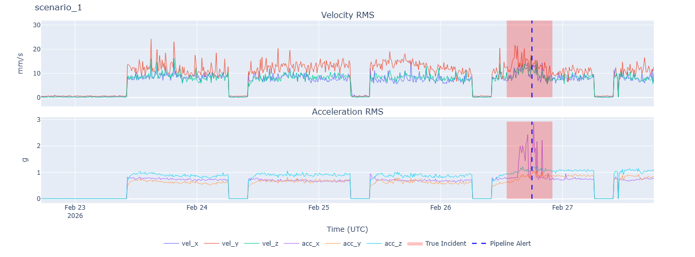

## 1. Baseline Analysis

Prior to implementation, an extensive analysis of the provided baseline code was performed in order to comprehend its purposeful limitations and establish a performance baseline. The detailed analysis of the code and its behavior revealed critical problems in both the Anomaly Model and the Alert Engine, as they ignored the physics behind the machinery's working conditions

### 1.1. `AnomalyModel`

The baseline model presented severe limitations on how it consumes and interpretes the physics of the industrial machines. Even though three-axis velocity and acceleration are provided, the model relied solely on the magnitude of the velocity array. This simplification presents two main issues:

* **Directionality Loss:** Rotating machines experience different absolute velocity values along their axes. Compressing this into one scalar value can mask failures that manifest as a change in velocity along only one or two main axes, while the overall velocity doesn't present a significant change - such as, for example, misalignment or unbalance.
* **Omission of the Acceleration data:** Mathematically, velocity acts as a low-pass filter in relation to acceleration - since the former is the integration of the latter over time. Hence, both convey information about different physical phenomena, and acceleration data, ignored in the baseline implementation, is responsible for identifying high-frequency, low-energy incidents such as micro-cracking in bearings.

Besides these issues, the baseline implementation contains two other main concerns. The first one is the usage of the entirety of the data for both `fit` and `predict` stages, without filtering out information from when the machine was turned off (`uptime = False`). This data, even though not absolute zero, is basically noise, corrupting the baseline by changing the expected values calculated for the features and generating false positives by predicting failures when the rotor is simply not even working - as shown in Figure 1. The second one is that even though the *Z-Score* is computed for the absolute velocity, no quantitative value is returned by the model. This prevents the assessment of the worsening of the problem, which is necessary for the re-alert on escalation.

*Figure 1: False Positive during downtime for scenario 3.*

### 1.2. `AlertEngine`

The temporal logic applied to the predictions received from the `AnomalyModel` was incompatible with the purpose of the task for two main reasons:

* **Definitive Blockage of New Alerts:** For each sample being predicted, after the first alert was triggered, no other alert could be fired since the locked state became permanent in the code. This causes a permanent blindness in the system — if the degradation increases or if the incident state is reversed after a certain period, there is no way for the user to detect it. Hence, no re-alerts could be fired - and one example can be seen in Figure 2, in which even though the original pipeline would have generated an alarm during the incidents, a previous False Positive prevented it from happening.
* **Immediate Trigger Without Temporal Confirmation:** The alert was being triggered instantaneously by the `predict` method based on a single anomalous window. Transient non-destructive mechanical shocks or the oscillation of the metrics when the machine is being turned on can be responsible for a single firing of the `AnomalyModel`.

*Figure 2: Previous False Positive alert for scenario 7 prevented the two True Positives to be triggered.*

### 1.3. Initial Metrics

As a direct consequence of the flawed implementation, which lacks an understanding of the physical reality, the baseline model presented the following poor results:

* **Captured Incidents (Recall):** Out of 29 total incidents, the system was only capable of correctly identifying 5 of them, which represents a **17.24%** recall.
* **False Positives:** The system generated **19** total alerts, of which **73.68%** were *False Positives* — generating almost triple the alerts for normal windows than for faulty ones.
* **Global F1-Score:** The overall **F1-Score** for all 29 samples tested was **20.83%**.

## 2. Methodology

In order to improve the baseline implementation, the entire architecture was redesigned with a focus on creating a system capable of comprehending the multivariate behavior of the machine and managing the alert lifecycle.

### 2.1. `AnomalyModel`

The feature extraction and fit algorithms were completely replaced to better capture the complex mechanics of the problem:

* **Multivariate Integration (6D):** The model now ingests all velocity and acceleration data simultaneously.
* **Baseline Sanitization:** A filter was implemented to keep only samples in which the machine was running (`uptime == True`), both in `fit` and `predict` stages. Furthermore, a window is only considered as a potential anomaly if more than half of its samples were captured while the machine was running. Otherwise, the window is skipped.
* **Mahalanobis Distance (MD):** Initially, both the *Z-Score* approach applied to all six variables independently and the Mahalanobis Distance (MD) were implemented and tested against each other. Throughout all developmental stages, the MD performed better due to its capability of extracting correlation information between the vibration directions and was chosen as the main metrics to solve the problem.

> **Mahalanobis Distance**
>
> The Mahalanobis Distance ($MD$) quantifies the distance between an observation vector and a multivariate data distribution but, unlike the standard Euclidean distance, it accounts for the variance of each individual variable and the covariance between them. It is mathematically defined as:
>
> $$MD(\vec{x}) = \sqrt{(\vec{x} - \vec{\mu})^T \Sigma^{-1} (\vec{x} - \vec{\mu})}$$
> 
> Where:
> * $\vec{x}$ is the observation vector (in this case, it's the 6D array of velocity and acceleration readings).
> * $\vec{\mu}$ is the mean vector of the baseline distribution.
> * $\Sigma^{-1}$ is the inverse of the covariance matrix of the baseline data.
> * $(\vec{x} - \vec{\mu})^T$ is the transpose of the mean-centered observation.
> 
> By utilizing the inverse covariance matrix ($\Sigma^{-1}$), the metric normalizes the multidimensional space. It effectively penalizes deviations that break the historical correlation between the axes (e.g., a sudden peak in the Z-axis while X and Y remain stable), making it exceptionally sensitive to directional mechanical faults that would otherwise be hidden by the natural vibration variance.

* **Strategy Assessment:** Other models, such as *Isolation Forest*, were considered in early stages but discarded due to the superior performance of the MD strategy, the need for explainable results that could be acted upon and the time necessary to perform its tuning.
* **Window Score Calculation:** The model now exports a numerical continuous score, computed as the average of the MDs of the samples within the window. This approach was defined through empirical testing, which showed that the average—even though skewed by extreme samples—offered a more stable representation of the window than the maximum value (too sensitive to outliers) or percentile-based approaches (too few samples per window).
* **Explainability and Root Cause Analysis:** While the MD is excellent for detecting anomalies in a multivariate space, it compresses the 6D data into a single scalar, which can obscure the physical origin of the fault. In order to make the results understandable by others and make alerts actionable for the maintenance team, an "unmasking" step was implemented. When an anomaly is identified, the algorithm evaluates the individual contribution of each feature to the final distance score. The most responsible axes are extracted and attached to the `PredictOutput`. This allows the `AlertEngine` to explicitly state the root causes of the alarm, informing the operator not only that an anomaly occurred, but which variable is the responsible for it, so the physical failure can be more objectively found and repaired.

### 2.2. `AlertEngine`

The `AlertEngine` was refactored to operate as a robust state machine, capable of interpreting the temporal evolution of the problem instead of reacting to isolated instances:

* **Noise Suppression by Temporal Buffering:** To avoid the instantaneous firing of alerts, a consecutive alert gateway was implemented. A minimum number of consecutive windows must be tagged as anomalous for an alert to be fired. If a normal window is detected within this interval, the counter resets. For this problem, the optimal threshold was found to be two consecutive windows. While this may seem like a minor change given the overlapping nature of the windows, it proved sufficient to suppress enough false positives to justify the implementation.
* **Escalation Mechanism (Re-alert):** The window score implemented in `AnomalyModel` is used to track the anomaly level at the moment an alert is triggered and compare it to the current instantaneous score. If the score increases by a constant factor relative to the initial alert, the alert is reactivated to warn the operator that the condition has aggravated, and the threshold is updated to prevent redundant continuous warnings.
* **Alert Unblocking:** A *forgetting mechanism* was defined: if the machine operates for a long period without anomaly states being detected after an alert, the system concludes that it has returned to a normal state and the lock is lifted. For this problem, the optimal period was found to be 12 hours.

### 2.3. Hyperparameter Tuning

Hyperparameter tuning was performed based on overall metric optimization, visual observation of generated plots, and the statistical distribution of the data. The final values adopted for this implementation were:

| Class | Hyperparameter | Value |
| --- | --- | --- |
| `AnomalyModel` | `model_window_size_hours` | 2 | 
| `AnomalyModel` | `mahalanobis_mean_threshold` | 10 |
| `AlertEngine` | `consecutive_anomalies_to_alert` | 2 |
| `AlertEngine` | `increase_to_realert` | 3.0 |
| `AlertEngine` | `hours_to_clear` | 12 |

### 2.4. Evaluation Pipeline Improvements

Although the challenge restricts the modification of utility functions for the final submission, some changes were made during development to improve the process:

* **Plotting:** Plots were updated to show not only the emitted alerts but all events deemed *alert-worthy*. This helped in defining hyperparameters and understanding problem dynamics. The code was also modified to save `.html` files in a dedicated folder rather than opening windows instantaneously, allowing for asynchronous analysis.
* **Metrics:** The overall metrics `.json` file was updated to aggregate all files containing **False Positives** and **False Negatives**, streamlining the investigation of specific issues. Additionally, logic was added to read existing metrics before saving, printing the delta in performance to easily assess the improvements between different approaches and identify which specific scenarios were responsible for them.

## 3. Performance

In order to assess the new architecture, the same samples were used for testing. The results show a significant improvement in the capability of detecting real failures when compared to the limitations of the baseline.

### 3.1. Global Metrics

The consolidated analysis of all 29 incidents present in the dataset reveals the following metrics:

* **Captured Incidents (Recall):** The model correctly identified **18** of the 29 incidents, increasing the recall to **62.06%**, which represents more than 3 times the baseline's performance.
* **False Positives (FP):** The system generated a total of **19** False Positives, a higher number than in the baseline, but with a concentrated distribution among three main samples.
* **Global F1-Score:** Even though the total number of **FPs** increased, both precision and recall improved with this new implementation, resulting in a final **54.54%** F1-Score, which more than doubles the original performance, but still shows room for improvement.

### 3.2. Performance Analysis

The detailed investigation of the behavior of the model by machine has validated some of the choices made and provided valuable diagnoses about the nature of the False Positives:

* **Noise Suppression Validation:** The pipeline implemented in `AlertEngine` has proven its value by suppressing spurious alerts that otherwise would have happened in samples 1 and 8.
* **The Early Alerts Phenomenon:** In four machines (3, 6, 21, and 26), the failure was identified slightly before the incident window marked in the provided data. In all of these cases, the failure worsened significantly as time passed, and in three of these cases, the re-alert strategy fired within the incident window - marking them as both False Positives and True Positives for the same faulty behavior. This mechanism can be clearly seem in Figure 3, which depicts the pipeline prediction for scenario 21.

*Figure 3: Re-alert upon escalation within the incident window for scenario 21.*

* **False Positive Concentration:** The distribution of the False Positives shows that **13** out of all 19 were concentrated in just 3 files - with a special highlight to sample 5, which had a total of 8. This behavior shows that the model presents a specific hypersensitivity to the particular vibration profiles of these three machines, rather than a general weakness of the algorithm.
* **Explicability:** For the True Positives, the implementation of the explicability mechanism has shown great correlation with the visual assessment of the actual behavior of the data, as shown in Figure 4 and Figure 5. This has proven that it was possible to turn the analytical analysis into an actionable notification for the maintainance team with the source of the problem.

*Figure 4: Alert text indicating **acceleration** in the x-axis source of the anomaly for scenario 1.*

*Figure 5: Scenario 1 True Positive showing a significant change in acceleration in the x-axis.*

## 4. Limitations and Future Work

Even though the current implementation based on the MD represents a major improvement with respect to the baseline, the development process and detailed analysis of the mistakes have revealed structural limitations, as listed below.

* **Frequency Analysis:** A fundamental limitation of the problem is the extremely low **sampling** frequency, which invalidates any spectral analysis and restricts our problem to the time domain.
* **The Trade-Off of the Multivariate Approach:** The analysis of the False Negatives indicates that in most cases, the failure was concentrated within just one axis or mainly on velocity or acceleration. While the MD is a great way to identify changes in the correlation between the variables, some of the incidents were hidden by the dilution of the distortion in only some of the axes because the coordination of all the others remained unaltered.
* **Mixed Approaches Testing:** In order to mitigate the False Negative problem, which was considered the main issue with this solution, several mixed approaches were tested during development, either combining the MD with *Z-score* methods or trying to capture isolated peaks within the MD instead of the mean coordination. However, even though more True Positives were found, these solutions introduced many more False Positives, failing to compensate for the improvement. The decision to keep the MD was the most balanced solution achieved.
* **Calibration Instability Due to Low Uptime Percentage:** The investigation into the behavior of sample 5 - which concentrated 8 total False Positives - has revealed that both the fit and the predict files had many separated `uptime = False` periods. Even when data immediately after the machine was turned on was filtered out - which could have **caused** some influence due to the transitional period - the False Positives still persisted. The lack of uptime data could have resulted in a more fragile covariance matrix, which generated the increased amount of incorrect alerts.
* **Dynamic Limits per Machine:** Even though during the implementation of this solution a global fixed threshold was the best performing strategy, the development of dynamic and adaptive thresholds computed individually for each scenario could help prevent the high amount of False Positives observed.
* **Advanced Unsupervised Models:** With more time for tuning and more continuous operational data, unsupervised deep-learning strategies could be explored, with a post-processing strategy to increase the explainability of the output.